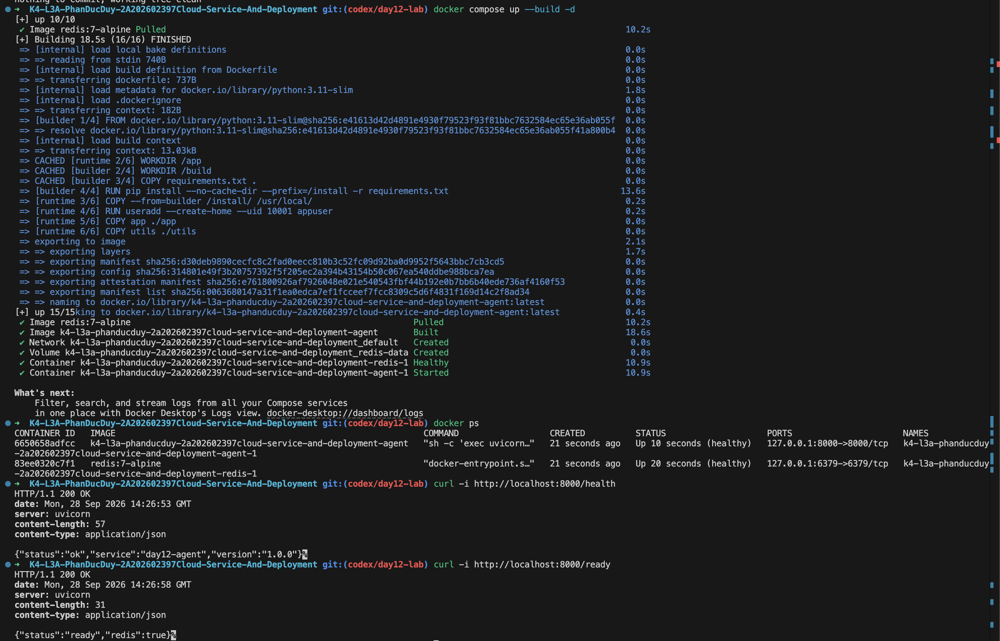

# Thông Tin Deploy — Checkpoint 5

## Thông Tin Học Viên

| Mục | Nội dung |
|-----|----------|
| Họ và tên | Phan Đức Duy |
| Mã học viên | 2A202602397 |
| Repo | https://github.com/DuykoNgu/K4-L3A-PhanDucDuy-2A202602397Cloud-Service-And-Deployment |

## Service

| Mục | Nội dung |
|-----|----------|
| Platform | Docker Compose local — phương án dự phòng |
| Local URL | http://localhost:8000 |
| Public URL | Chưa có; service chỉ chạy trên máy local |
| Ngày kiểm tra | 28/09/2026 |

Học viên chọn Docker local cho CP5, chưa triển khai lên Railway, Render hay
Cloud Run. Dùng `LOCAL_FALLBACK=true`; điểm CP5 tối đa 9/15 theo rubric.

## Biến Môi Trường

Chỉ liệt kê tên biến và nguồn cấu hình, không công khai giá trị khóa.

| Biến | Nguồn cấu hình |
|------|----------------|
| `PORT` | `.env`, Docker Compose truyền vào container agent |
| `AGENT_API_KEY` | Khóa riêng trong `.env`, được bỏ qua bởi Git; Docker Compose truyền vào agent |
| `REDIS_URL` | Docker Compose đặt địa chỉ service Redis trong mạng nội bộ của stack |
| `RATE_LIMIT_PER_MINUTE` | `.env`, mặc định 10 request/phút/user |
| `MONTHLY_BUDGET_USD` | `.env`, mặc định 10 USD/tháng/user |
| `LOG_LEVEL` | `.env`, mặc định INFO |
| `LOCAL_FALLBACK` | `.env`, đặt true để test CP5 kiểm tra localhost |

## Lệnh Kiểm Tra

Chạy ở thư mục gốc repo:

```bash
docker compose up -d --build --wait
docker compose ps
curl -i http://localhost:8000/health
curl -i http://localhost:8000/ready
curl -i -X POST http://localhost:8000/ask \
  -H "Content-Type: application/json" \
  -d '{"question":"Hello"}'
LOCAL_FALLBACK=true .venv/bin/python -m pytest tests/test_cp5.py -v
```

## Kết Quả Chạy Thật

Kiểm tra trực tiếp ngày 28/09/2026:

```text
GET /health → HTTP 200 OK
{"status":"ok","service":"day12-agent","version":"1.0.0"}

GET /ready → HTTP 200 OK
{"status":"ready","redis":true}

POST /ask không có X-API-Key → HTTP 401 Unauthorized
{"detail":"invalid or missing API key"}
```

## Ảnh Chụp Màn Hình

Ảnh `screenshots/image.png` ghi lại quá trình build, các container agent và
Redis ở trạng thái healthy, cùng kết quả `/health` và `/ready` trả HTTP 200.


