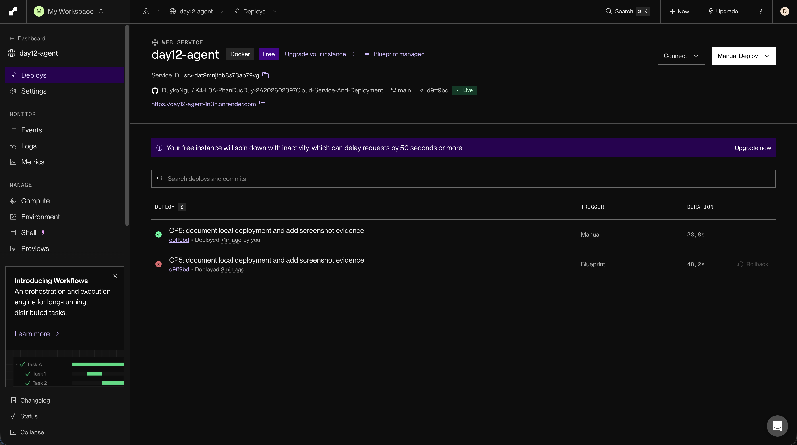

# Thông Tin Deploy — Checkpoint 5

## Thông Tin Học Viên

| Mục | Nội dung |
|-----|----------|
| Họ và tên | Phan Đức Duy |
| Mã học viên | 2A202602397 |
| Repo | https://github.com/DuykoNgu/K4-L3A-PhanDucDuy-2A202602397Cloud-Service-And-Deployment |

## Service

| Mục | Nội dung |
|-----|----------|
| Platform | Render — Web Service Docker và Key Value tương thích Redis |
| Public URL | https://day12-agent-1n3h.onrender.com |
| Branch | main |
| Ngày kiểm tra | 28/09/2026 |

Service đã được kiểm tra qua HTTPS công khai. Máy local dùng
`LOCAL_FALLBACK=false` để test CP5 gọi service Render.

Đường dẫn `/` chưa có endpoint nên trả HTTP 404 với `{"detail":"Not Found"}`.
Dùng `/health` để kiểm tra liveness, `/ready` để kiểm tra Redis, hoặc `/docs`
để xem tài liệu API.

## Biến Môi Trường

Chỉ liệt kê tên biến và nguồn cấu hình, không công khai giá trị khóa.

| Biến | Nguồn cấu hình |
|------|----------------|
| `PORT` | Render cấp cho web service; Dockerfile chạy server theo biến này |
| `AGENT_API_KEY` | Giá trị riêng được nhập trong Environment của day12-agent |
| `REDIS_URL` | Blueprint lấy connectionString nội bộ từ day12-redis |
| `RATE_LIMIT_PER_MINUTE` | render.yaml đặt 10 request/phút/user |
| `MONTHLY_BUDGET_USD` | render.yaml đặt 10 USD/tháng/user |
| `LOG_LEVEL` | render.yaml đặt INFO |
| `LOCAL_FALLBACK` | .env local đặt false để kiểm tra cloud |
| `DEPLOY_API_KEY` | .env local giữ khóa của service Render để kiểm tra /ask có xác thực |

## Lệnh Kiểm Tra

Chạy ở thư mục gốc repo:

```bash
LAB_URL='https://day12-agent-1n3h.onrender.com'
curl -i "$LAB_URL/health"
curl -i "$LAB_URL/ready"
curl -i -X POST "$LAB_URL/ask" \
  -H "Content-Type: application/json" \
  -d '{"question":"Hello"}'
.venv/bin/python -m pytest tests/test_cp5.py -v
```

Test có xác thực đọc `DEPLOY_API_KEY` từ .env local; khóa không nằm trong repo.

## Kết Quả Chạy Thật

Kiểm tra trực tiếp service Render ngày 28/09/2026:

```text
GET /health → HTTP 200
{"status":"ok","service":"day12-agent","version":"1.0.0"}

GET /ready → HTTP 200
{"status":"ready","redis":true}

POST /ask không có X-API-Key → HTTP 401
{"detail":"invalid or missing API key"}

POST /ask có X-API-Key hợp lệ → HTTP 200
user_id: cp5-cloud-verification
history_length: 0
cost_usd: 0.00002265
tokens: {"in":3,"out":37}
answer: Ngắn gọn: Deploy la gi phụ thuộc vào ba yếu tố — cấu hình qua biến môi trường, health check để orchestrator biết trạng thái, và giới hạn tài nguyên.
```

Chạy `tests/test_cp5.py` trên URL Render: **9 passed, 4 skipped**.
Bốn test local được bỏ qua vì đang dùng cloud; test /ask có khóa thật đã pass.

## Lỗi Deploy Và Cách Sửa

Lần đầu app dừng lúc startup với `ValidationError` cho `agent_api_key`:
`Field required`, sau đó `Application startup failed` và exit status 3.
Nguyên nhân là Environment của web service thiếu `AGENT_API_KEY`.

Đã thêm biến này trong Environment của day12-agent rồi Save and deploy.
Ảnh dashboard ghi lại lần deploy lỗi và lần deploy thành công; kiểm tra HTTP
sau khi thêm khóa xác nhận API đã hoạt động.

## Ảnh Chụp Màn Hình

- `screenshots/dashboard.png`: dashboard Render, URL HTTPS và trạng thái Live.
- `screenshots/image.png`: minh chứng Docker local trong giai đoạn chuẩn bị.
- `screenshots/health-local.png`: /health HTTP 200 ở localhost.
- `screenshots/ready-local.png`: /ready HTTP 200 ở localhost.



Để bổ sung minh chứng endpoint cloud, chụp kết quả /health và /ready trên
trình duyệt vào screenshots/health.png.

## Giới Hạn Gói Free

Web service Free có thể ngủ sau 15 phút không có truy cập; lần gọi đầu khi
đánh thức có thể chậm. Key Value Free không có persistence và mất dữ liệu
khi chính instance đó restart. Xem [giới hạn Render Free](https://render.com/docs/free).
